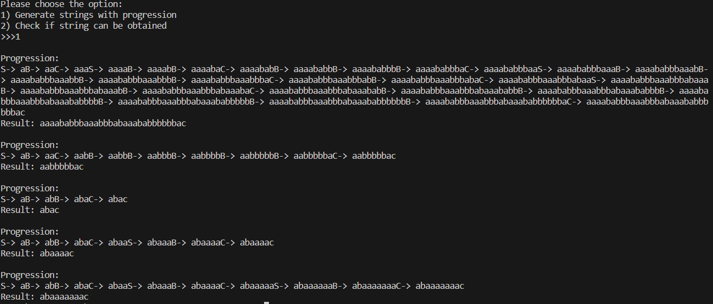
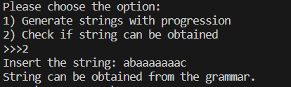

# Intro to formal languages. Regular grammars. Finite Automata.

### Course: Formal Languages & Finite Automata
### Author: Popov Nichita (Variant 23)

----

## Theory
When we talk about formal languages, imagine we're diving into the world of secret codes and special rules used to create those codes. Just like in any language, be it English, Python, or even music, we have an alphabet (a bunch of symbols or sounds), words (combinations of those symbols that make sense), and grammar (rules that tell us how to put those symbols together to make words or sentences). In the realm of computer science and math, these languages help computers and humans understand each other. They're the backbone of programming languages, web pages, and even the texts we send to friends. By studying formal languages, we're essentially learning how to craft these secret codes in a way that makes sense and serves our purpose, whether it's building an app, designing a game, or simply sending a message.

## Objectives:

1) Discover what a language is and what it needs to have in order to be considered a formal one.
2) Provide the initial setup for the evolving project that you will work on during this semester. You can deal with each laboratory work as a separate task or project to demonstrate your understanding of the given themes, but you also can deal with labs as stages of making your own big solution, your own project. Do the following:
    a. Create GitHub repository to deal with storing and updating your project.
    b. Choose a programming language. Pick one that will be easiest for dealing with your tasks, you need to learn how to solve the problem itself, not everything around the problem (like setting up the project, launching it correctly and etc.)
    c. Store reports separately in a way to make verification of your work simpler (duh)
3) According to your variant number, get the grammar definition and do the following:
    a. Implement a type/class for your grammar
    b. Add one function that would generate 5 valid strings from the language expressed by your given grammar
    c. Implement some functionality that would convert and object of type Grammar to one of type Finite Automaton
    d. For the Finite Automaton, please add a method that checks if an input string can be obtained via the state transition from it


## Implementation description

The project is structured around two primary classes: Grammar and Automata, each representing fundamental concepts in the theory of formal languages and automata.

* `Grammar` Class: This class encapsulates the components of a formal grammar, including non-terminal symbols (`VN`), terminal symbols (`VT`), and production rules (`P`). An instance of Grammar is initialized with predefined symbols and rules that represent the grammar of a simple language.

```python

class Grammar:
    def __init__(self):
        self.VN = ['S','B','C']
        self.VT = ['a','b','c']
        self.P = {
            'S':['aB'],
            'B':['aC','bB'],
            'C':['bB','c','aS']
        }

```
* `Automata` Class: This class represents a finite automaton that can be derived from the grammar. It includes methods for generating strings that belong to the language defined by the grammar (`generating_strings`) and for checking if a given string can be derived from the grammar (`check_string`).

    
    ```python
    import random as rn

    from .Grammar import Grammar

    class Automata:
        def __init__(self, grammar = Grammar()):
            self.grammar = grammar
        
        def generating_strings(self):
            for i in range(5):
                self.start = self.grammar.VN[0]
                self.progression = "S"
                while self.start[-1] not in self.grammar.VT:
                    temp = self.start[-1]
                    self.start = self.start[:-1]
                    self.start += rn.choice(self.grammar.P[temp])
                    self.progression += f"-> {self.start}"
                print(f"\nProgression: \n{self.progression}")
                print(f"Result: {self.start}")
        
        def check_string(self, input_string):
            current_strings = [input_string]
            steps = 0
            max_steps = 100 

            while steps < max_steps:
                next_strings = []
                for s in current_strings:
                    if s == self.grammar.VN[0]:
                        print("String can be obtained from the grammar.")
                        return True
                    
                    for non_terminal, productions in self.grammar.P.items():
                        for prod in productions:
                            if prod in s:
                                next_state = s.replace(prod, non_terminal, 1)
                                next_strings.append(next_state)
                
                if not next_strings:
                    break

                current_strings = list(set(next_strings))
                steps += 1

            print("String cannot be obtained from the grammar.")
            return False
    ```
Also we have a "construction point" where veerything is being collected - main.py file. There you can choose the option to perform:
    * Generate the strings
    * Check if string beongs to grammar
```python
from classes.Automata import Automata

user_choice = int(input("""Please choose the option:
1) Generate strings with progression
2) Check if string can be obtained\n>>>"""))

aut = Automata()
match user_choice:
    case 1:
        aut.generating_strings()
    case 2:
        user_input = input("Insert the string: ")
        aut.check_string(user_input)
```
## Results
As a result we get the following:
* Generating 5 strings with progresson shown using the grammar provided:
    
* Checking if a string belongs to the grammar:
    1. Positive case:
        
    2. Negative case:
        

## Conclusion 

In conclusion I want to say that the implementation effectively demonstrates the principles of formal languages and finite automata. By developing a grammar and corresponding finite automaton, we can explore how strings are generated and recognized within a language. This project lays the groundwork for further exploration of language processing and automata theory, providing a practical understanding of how theoretical concepts are applied in computational contexts.

## References

https://www.youtube.com/watch?v=dQw4w9WgXcQ
https://www.youtube.com/watch?v=Qa6csfkK7_I
https://www.youtube.com/watch?v=40i4PKpM0cI