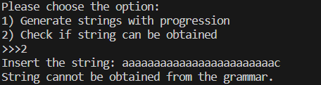

# Determinism in Finite Automata. Conversion from NDFA 2 DFA. Chomsky Hierarchy.

### Course: Formal Languages & Finite Automata
### Author: Popov Nichita (Variant 23)

----

## Theory
In the fascinating universe of computer science, determinism within finite automata is akin to navigating a complex maze with a clear, predefined path. Imagine a world where every decision point in the maze has a signpost, directing you exactly where to go next. This is the essence of deterministic finite automata (DFA), where every input leads to a singular, unambiguous outcome. However, life and computation are not always so straightforward, introducing us to nondeterministic finite automata (NDFA), where at certain crossroads, you're presented with multiple paths but no sign telling you which one to take. Converting from NDFA to DFA is like drawing a new map of the maze, one where every possible journey is considered and planned for, ensuring that no matter where you start, there's always a clear path to the end. This concept nestles within the Chomsky Hierarchy, a grand classification of grammatical complexity in languages, ranging from simple to complex. Finite automata sit at the lower levels of this hierarchy, handling languages of simpler structures, yet they are fundamental in understanding the building blocks of computational linguistics and the theoretical underpinnings of how machines interpret and process languages.

## Objectives:

1. Understand what an automaton is and what it can be used for.
2. Continuing the work in the same repository and the same project, the following need to be added:
    a. Provide a function in your grammar type/class that could classify the grammar based on Chomsky hierarchy.
    b. For this you can use the variant from the previous lab.
3. According to your variant number (by universal convention it is register ID), get the finite automaton definition and do the following tasks:
    a. Implement conversion of a finite automaton to a regular grammar.
    b. Determine whether your FA is deterministic or non-deterministic.
    c. Implement some functionality that would convert an NDFA to a DFA.
    d. Represent the finite automaton graphically (Optional, and can be considered as a __*bonus point*__):
    - You can use external libraries, tools or APIs to generate the figures/diagrams.
    - Your program needs to gather and send the data about the automaton and the lib/tool/API return the visual representation.

## Implementation description

The project is structured around two primary classes: Grammar and Automata, each representing fundamental concepts in the theory of formal languages and automata.

* `Grammar` Class: This class encapsulates the components of a formal grammar, including non-terminal symbols (`VN`), terminal symbols (`VT`), and production rules (`P`). An instance of Grammar is initialized with predefined symbols and rules that represent the grammar of a simple language.

```python

class Grammar:
    def __init__(self):
        self.VN = ['S','B','C']
        self.VT = ['a','b','c']
        self.P = {
            'S':['aB'],
            'B':['aC','bB'],
            'C':['bB','c','aS']
        }

```
* `Automata` Class: This class represents a finite automaton that can be derived from the grammar. It includes methods for generating strings that belong to the language defined by the grammar (`generating_strings`) and for checking if a given string can be derived from the grammar (`check_string`).

    
    ```python
    import random as rn

    from .Grammar import Grammar

    class Automata:
        def __init__(self, grammar = Grammar()):
            self.grammar = grammar
        
        def generating_strings(self):
            for i in range(5):
                self.start = self.grammar.VN[0]
                self.progression = "S"
                while self.start[-1] not in self.grammar.VT:
                    temp = self.start[-1]
                    self.start = self.start[:-1]
                    self.start += rn.choice(self.grammar.P[temp])
                    self.progression += f"-> {self.start}"
                print(f"\nProgression: \n{self.progression}")
                print(f"Result: {self.start}")
        
        def check_string(self, input_string):
            current_strings = [input_string]
            steps = 0
            max_steps = 100 

            while steps < max_steps:
                next_strings = []
                for s in current_strings:
                    if s == self.grammar.VN[0]:
                        print("String can be obtained from the grammar.")
                        return True
                    
                    for non_terminal, productions in self.grammar.P.items():
                        for prod in productions:
                            if prod in s:
                                next_state = s.replace(prod, non_terminal, 1)
                                next_strings.append(next_state)
                
                if not next_strings:
                    break

                current_strings = list(set(next_strings))
                steps += 1

            print("String cannot be obtained from the grammar.")
            return False
    ```
Also we have a "construction point" where veerything is being collected - `main.py` file. There you can choose the option to perform:
    * Generate the strings
    * Check if string belongs to grammar
```python
from classes.Automata import Automata

user_choice = int(input("""Please choose the option:
1) Generate strings with progression
2) Check if string can be obtained\n>>>"""))

aut = Automata()
match user_choice:
    case 1:
        aut.generating_strings()
    case 2:
        user_input = input("Insert the string: ")
        aut.check_string(user_input)
```
## Results
As a result we get the following:
* Generating 5 strings with progresson shown using the grammar provided:
    
* Checking if a string belongs to the grammar:
    * Positive case:
        
    * Negative case:
        

## Conclusion 

In conclusion I want to say that the implementation effectively demonstrates the principles of formal languages and finite automata. By developing a grammar and corresponding finite automaton, we can explore how strings are generated and recognized within a language. This project lays the groundwork for further exploration of language processing and automata theory, providing a practical understanding of how theoretical concepts are applied in computational contexts.

## References

* https://www.youtube.com/watch?v=Qa6csfkK7_I
* https://www.youtube.com/watch?v=40i4PKpM0cI
* https://www.youtube.com/watch?v=dQw4w9WgXcQ